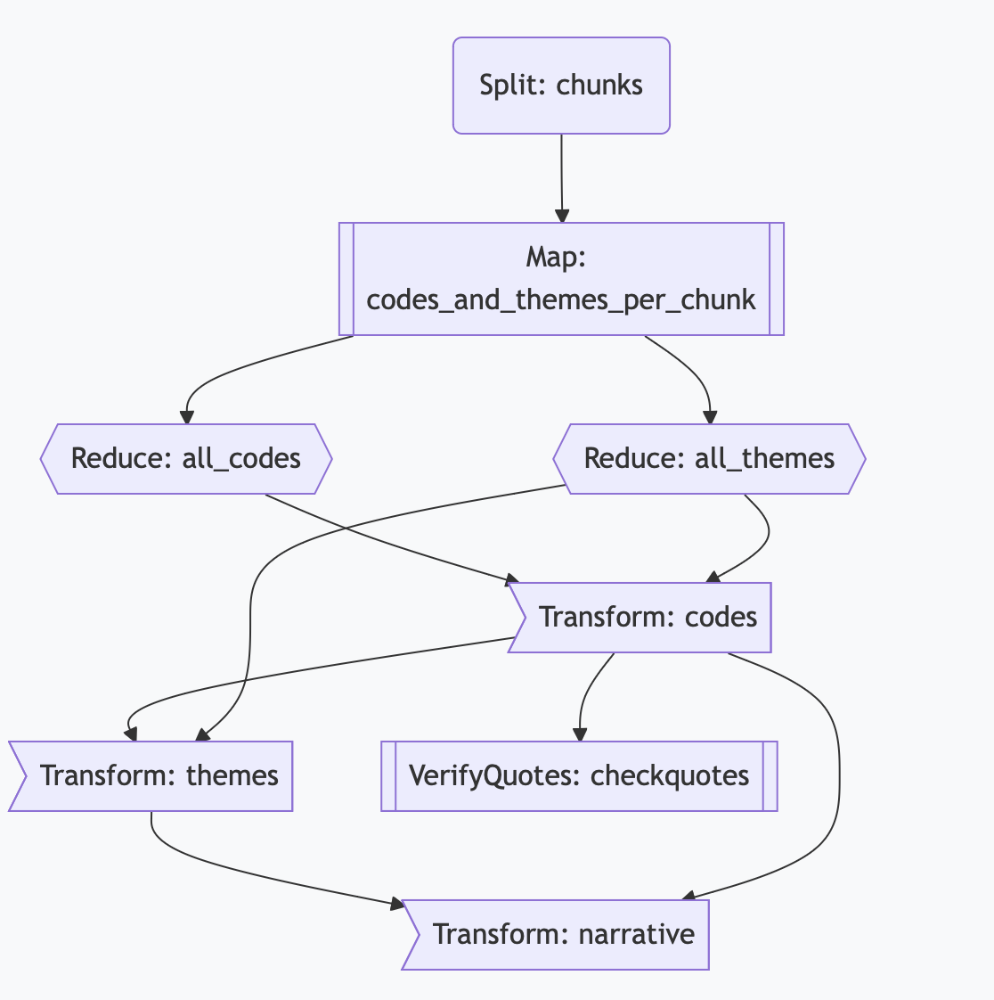
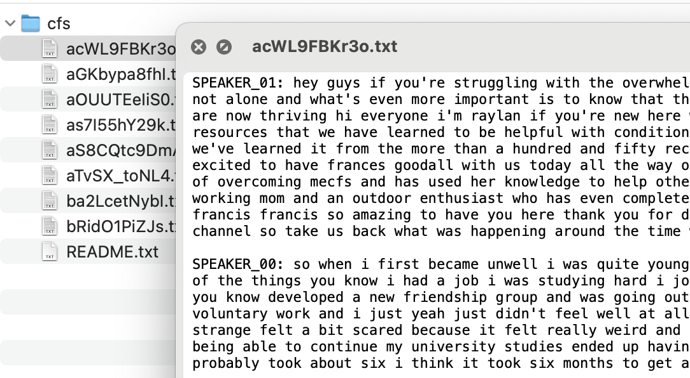
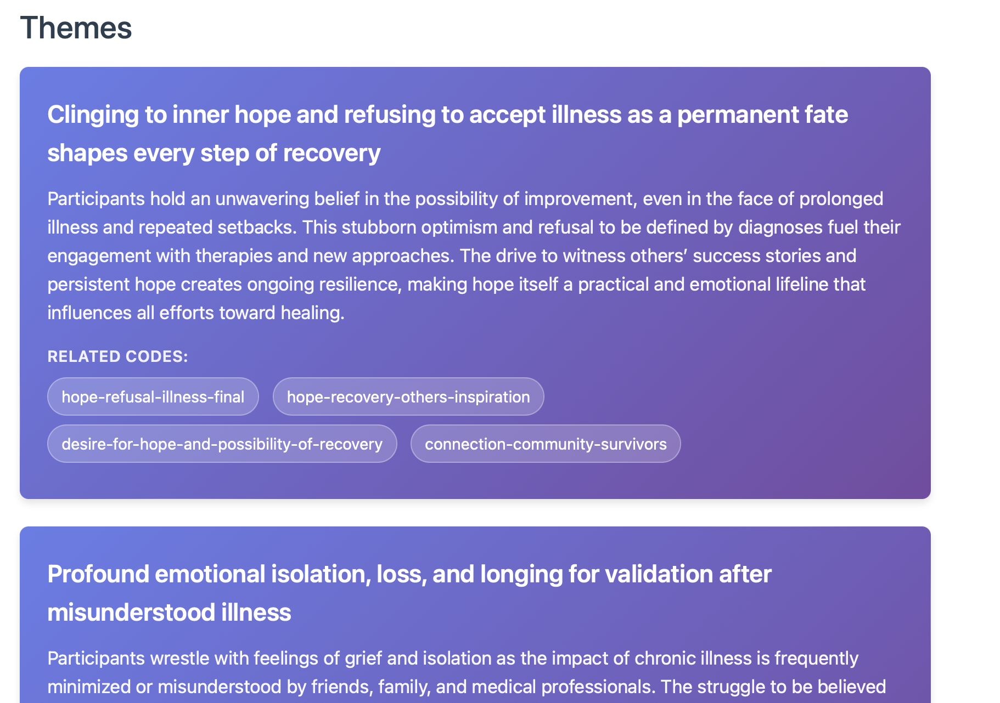
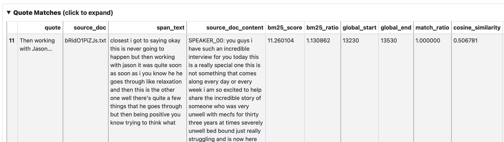
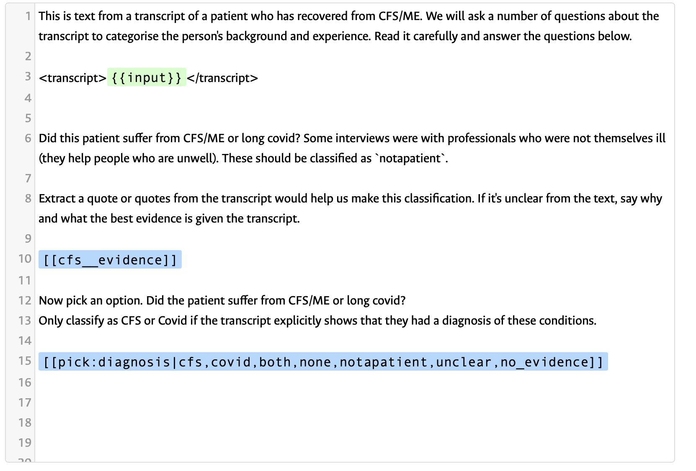
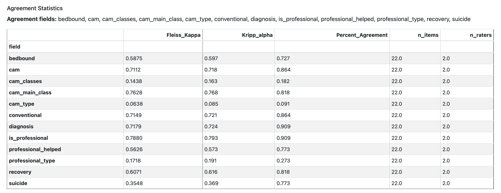
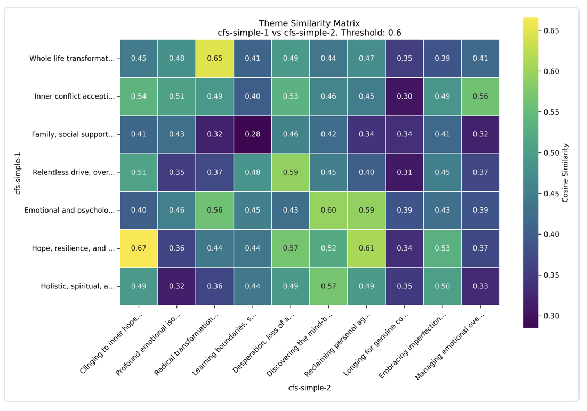
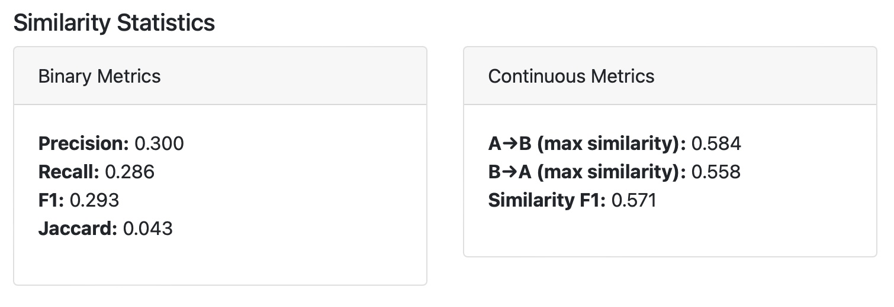

# Get to saturation faster!


**`soak` is a tool to enable qualitative researchers to rapidly define and run llm-assisted text analysis pipelines and thematic analysis.**


## What does it do?

The easiest way to see what `soak` does is to see sample outputs from the system.

The Zero-shot pipeline diagram shows the various stages the analysis involves:



Input text from [patient interviews](soak/data/cfs/):



Sample theme extracted: 



Matching LLM extracted quotes to source text to detect hallucinations:




A classification prompt, extracting structured data from transcripts. The green element is the templated input. The blue elements like `[[this]]` indicate the LLM-completions. Prompts are written in [struckdown](https://github.com/benwhalley/struckdown), is a simple text-based format used to constrain the LLM output to a specific data type/structure.



Inter-rater agreement and ground truth validation statistics, calculated for structured data extracted from transcripts:



**Ground truth validation:** Classifier nodes can automatically validate LLM outputs against ground truth labels, calculating precision, recall, F1, and confusion matrices:

```yaml
ground_truths:
  reflection:
    existing: reflection_exists  # Ground truth column
    mapping: {yes: 1, no: 0}     # Map LLM outputs to GT values
```

See [Ground Truth Validation](docs/how-to/ground-truth-validation.md) for details.

Plots and similarity statistics quantify the similarity between sets of themes created by different analyses. For example we might compare different LLMs, different datasets (patients vs doctors) or different prompts (amending the research question posed to the LLM). The heatmap reveals common themes between different analyses or datasets:



Similarity statistics quantify the similarity between sets of themes created by different analyses.




### Sample outouts

- [cfs1_simple.html](https://benwhalley.github.io/soak/samples/cfs1_simple.html) shows a thematic analysis of transcripts of 8 patients with ME/CFS or Long COVID.

- [cfs2_pipeline.html](https://benwhalley.github.io/soak/samples/cfs2_simple.html)  shows the same analysis using a different LLM model, and in extended HTML format.

- [comparison.html](https://benwhalley.github.io/soak/samples/comparison.html) shows the comparison of these two analyses.

- [20251008_085446_5db6_pipeline.html](https://benwhalley.github.io/soak/samples/classifier/20251008_085446_5db6_pipeline.html) shows the result of a different pipeline extracting structured data from the transcripts (results are also available as json and csv).

### Example pipeline specifications

- [soak/pipelines/zs.soak](soak/pipelines/zs.soak) is the Zero-shot pipeline used in the sample outputs above.

- [classifier.soak](docs/samples/classifier/classifier.soak) is the classifier pipeline used in the sample output above.

## Quick Start

```bash
# install
git clone https://github.com/benwhalley/soak
uv install . tool

# set credentials, using openai for simplicity
export LLM_API_KEY=your_api_key
export LLM_API_BASE=https://api.openai.com/v1

# Run analysis
soak zs soak/data/cfs/*.txt -t simple -o cfs-simple-1

# Open results in a browser
open cfs-simple-1_simple.html

# Re-run with a different/better model
soak zs -o cfs-simple-2 --model-name="openai/gpt-4o" soak/data/cfs/*.txt

# Compare results
soak compare cfs-simple-1.json cfs-simple-2.json -o comparison.html
```


## More usage

```bash
# Basic pattern
uv run soak <pipeline> <files> --output <name>

# Run demo pipeline on sample text files
uv run soak demo --output demo_analysis soak/data/cfs/*.txt

# Use the 'simple' html output template
uv run soak zs -t simple --output analysis_simple soak/data/cfs/*.txt
```

### Working with CSV/XLSX Spreadsheets

CSV and XLSX files are fully supported. Each row becomes a separate document, with column values accessible in templates as `{{column_name}}`.

**Example data** (`soak/data/test_data.csv`):
```csv
participant_id,age,condition,response
P001,25,control,I felt very relaxed during the session
P002,32,treatment,The intervention helped me focus better
```

**Run classifier on CSV:**
```bash
uv run soak classifier_tabular --output csv_analysis soak/data/test_data.csv
```

**Pipeline template accessing columns:**

```yaml
# pipeline.soak
nodes:
  - name: analyze
    type: Map
    inputs: [documents]
---#analyze
Participant {{participant_id}} (age {{age}}, {{condition}} group):
{{response}}

Summarize the response: [[summary:str]]
```

**Sampling options:**
```bash
# Process first 10 rows only (useful for testing)
uv run soak classifier_tabular --head 10 --output test_run survey.csv

# Randomly sample 50 rows
uv run soak classifier_tabular --sample 50 --output pilot survey.csv
```

See [Working with Spreadsheet Data](docs/how-to/working-with-spreadsheet-data.md) for more details.


## Documentation

- [Docs index](docs/index.md)
- [Getting started](docs/tutorials/getting-started.md)

See [CLAUDE.md](CLAUDE.md) for architecture details.


## License

AGPL v3 or later

Please cite: Ben Whalley. (2025). benwhalley/soak: Initial public release (v0.3.0). Zenodo. https://doi.org/10.5281/zenodo.17293023
