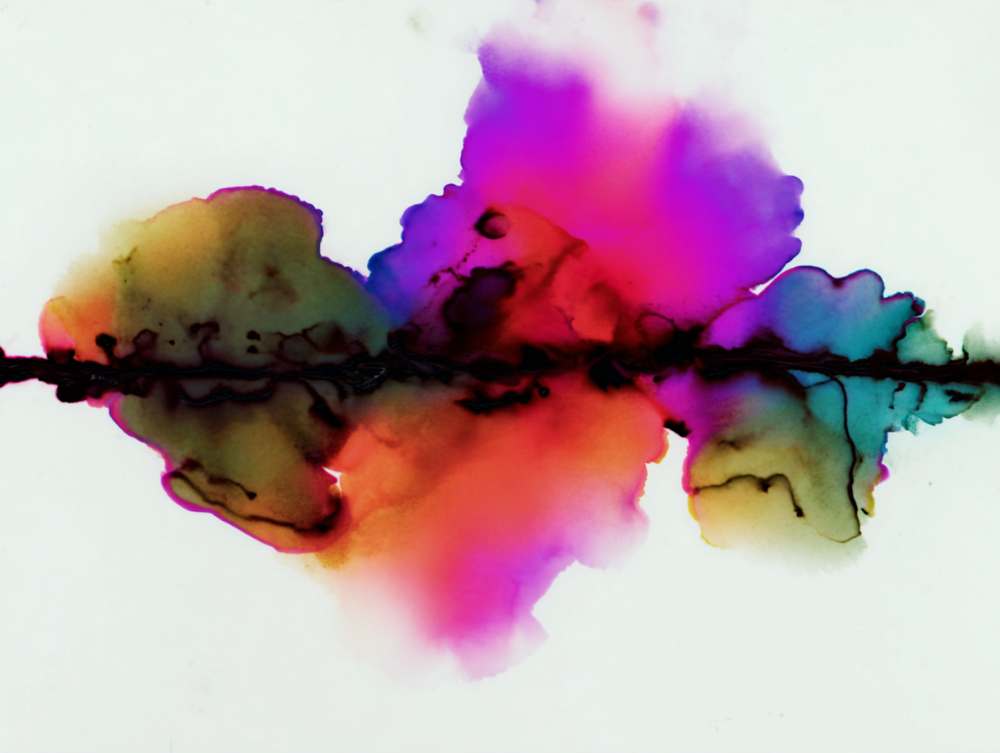

# soak




**Graph-based pipelines for LLM-assisted qualitative text analysis.**

Soak helps qualitative researchers rapidly define and run text analysis pipelines -- thematic analysis, classification, and structured data extraction from interviews, surveys, and documents.


## Documentation

Full documentation: **[benwhalley.github.io/soak](https://benwhalley.github.io/soak/)**


## Quick start

```bash
uv tool install soaking

soak test  # set up credentials

soak zs "soak-data/cfs/a*" -t simple -o my-analysis
open my-analysis_dump/my-analysis_simple.html
```


## License

AGPL v3 or later

Please cite: Ben Whalley. (2025). benwhalley/soak: Initial public release (v0.3.0). Zenodo. https://doi.org/10.5281/zenodo.17293023
