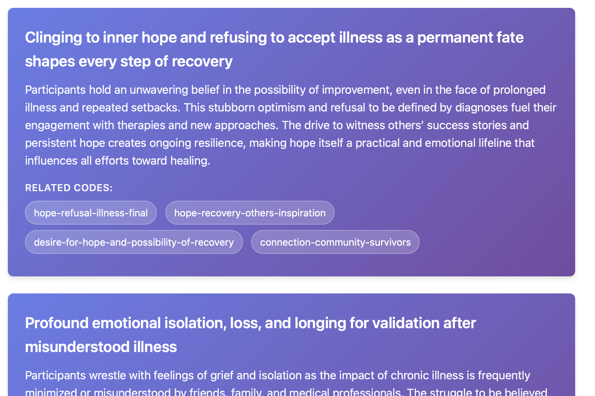

# Get to saturation faster!


**`soak` is a tool to enable qualitative researchers to rapidly define and run llm-assisted text analysis pipelines and thematic analysis.**

The easiest way to see what `soak` does is to see sample outputs from the system.

The Zero-shot pipeline diagram shows the various stages the analysis involves:


Input text from [patient interviews](soak/data/cfs/):


Sample theme extracted: 



Matching LLM extracted quotes to source text to detect hallucinations:


A classification prompt, extracting structured data from transcripts. The green element is the templated input. The blue elements like `[[this]]` indicate the LLM-completions. Prompts are written in [struckdown](https://github.com/benwhalley/struckdown), is a simple text-based format used to constrain the LLM output to a specific data type/structure.


Inter-rater agreement statistics, calculated for structured data extracted from transcripts:


Plots and similarity statistics quantify the similarity between sets of themes created by different analyses. For example we might compare different LLMs, different datasets (patients vs doctors) or different prompts (amending the research question posed to the LLM). The heatmap reveals common themes between different analyses or datasets:


Similarity statistics quantify the similarity between sets of themes created by different analyses.


### Sample outouts

- [cfs1_simple.html](https://benwhalley.github.io/soak/samples/cfs1_simple.html) shows a thematic analysis of transcripts of 8 patients with ME/CFS or Long COVID.

- [cfs2_pipeline.html](https://benwhalley.github.io/soak/samples/cfs2_simple.html)  shows the same analysis using a different LLM model, and in extended HTML format.

- [comparison.html](https://benwhalley.github.io/soak/samples/comparison.html) shows the comparison of these two analyses.

- [20251008_085446_5db6_pipeline.html](https://benwhalley.github.io/soak/samples/classifier/20251008_085446_5db6_pipeline.html) shows the result of a different pipeline extracting structured data from the transcripts (results are also available as json and csv).

### Example pipeline specifications

- [soak/pipelines/zs.yaml](soak/pipelines/zs.yaml) is the Zero-shot pipeline used in the sample outputs above.

- [classifier.yaml](docs/samples/classifier/classifier.yaml) is the classifier pipeline used in the sample output above.

## Quick Start

```bash
# install
git clone https://github.com/benwhalley/soak
uv tool install .

# set credentials, using openai for simplicity
export LLM_API_KEY=your_api_key
export LLM_API_BASE=https://api.openai.com/v1

# Run analysis
soak run zs data/cfs/\*.txt -t simple -o cfs-simple-1

# Open results in a browser
open docs/samples/cfs-simple-1.html

# Re-run with a different/better model
soak run zs data/cfs/\*.txt -o cfs-simple-2 --model-name="litellm/gpt-4.1"

# Compare results
soak compare cfs-simple-1.json cfs-simple-2.json --output=comparison.html
```


## More usage

```bash
uv run soak run <pipeline> <files> --output <name>

# Examples
uv run soak run demo yourdata/*.txt --output analysis1

# with the 'simple' html output template
uv run soak run zspe data/interviews.docx -t simple --output analysis2
```


**Options:**
- `--output, -o`: Output filename (generates .json dump file and .html)
- `--model-name`: LLM model (default: gpt-4o-mini)
- `-c, --context`: Pipeline context variables (e.g., `-c research_question="Experiences of patients with COVID-19"`)


## Documentation

- [Docs index](docs/index.md)
- [Getting started](docs/tutorials/getting-started.md)

See [CLAUDE.md](CLAUDE.md) for architecture details.


## License

AGPL v3 or later

Please cite: Ben Whalley. (2025). benwhalley/soak: Initial release (v0.3.0). Zenodo. https://doi.org/10.5281/zenodo.17293023
