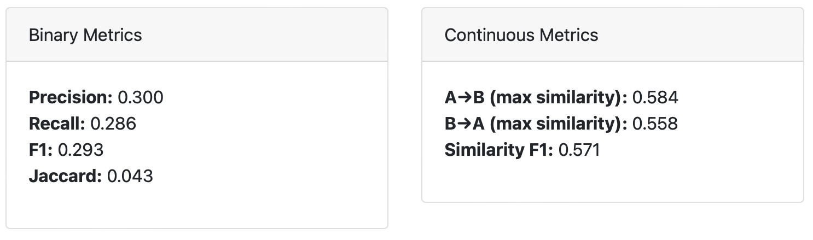

# Soak: Get to saturation faster 
#### Graph-based pipelines for LLM-assisted qualitative text analysis


## Overview


`soak` is a tool to enable qualitative researchers to rapidly define and run llm-assisted text analysis pipelines and thematic analysis.

The easiest way to see what `soak` does is to see sample outputs from the system.

The Zero-shot pipeline diagram shows the various stages the analysis involves:


Input text from [patient interviews](soak/data/cfs/):


Sample themes extracted: 


Matching LLM extracted quotes to source text to detect hallucinations:


A classification prompt, extracting structured data from transcripts. The green element is the templated input. The blue elements like `[[this]]` indicate the LLM-completions. Prompts are written in [struckdown](https://github.com/benwhalley/struckdown), is a simple text-based format used to constrain the LLM output to a specific data type/structure.


Inter-rater agreement statistics, calculated for structured data extracted from transcripts:


Plots and similarity statistics quantify the similarity between sets of themes created by different analyses. For example we might compare different LLMs, different datasets (patients vs doctors) or different prompts (amending the research question posed to the LLM). The heatmap reveals common themes between different analyses or datasets:


Similarity statistics quantify the similarity between sets of themes created by different analyses.




### Sample outouts

- [cfs1_simple.html](docs/samples/cfs1_simple.html) shows a thematic analysis of transcripts of 8 patients with ME/CFS or Long COVID.

- [cfs2_pipeline.html](docs/samples/cfs2_simple.html)  shows the same analysis using a different LLM model, and in extended HTML format.

- [comparison.html](docs/samples/comparison.html) shows the comparison of these two analyses.

- [20251008_085446_5db6_pipeline.html](docs/samples/20251008_085446_5db6_pipeline.html) shows the result of a different pipeline extracting structured data from the transcripts.


### Example pipeline specifications

- [soak/pipelines/zs.yaml](soak/pipelines/zs.yaml) is the Zero-shot pipeline used in the sample outputs above.

- [classifier.yaml](soak/docs/samples/classifier/classifier.yaml) is the classifier pipeline used in the sample output above.

## Quick Start

```bash
# install
git clone https://github.com/benwhalley/soak
uv tool install .

# set credentials, using openai for simplicity
export LLM_API_KEY=your_api_key
export LLM_API_BASE=https://api.openai.com/v1

# Run analysis
soak run zs data/cfs/\*.txt -t simple -o cfs-simple-1

# Open results in a browser
open docs/samples/cfs-simple-1.html

# Re-run with a different/better model
soak run zs data/cfs/\*.txt -o cfs-simple-2 --model-name="litellm/gpt-4.1"

# Compare results
soak compare cfs-simple-1.json cfs-simple-2.json --output=comparison.html
```


## More usage

```bash
uv run soak run <pipeline> <files> --output <name>

# Examples
uv run soak run demo yourdata/*.txt --output analysis1

# with the 'simple' html output template
uv run soak run zspe data/interviews.docx -t simple --output analysis2
```


**Options:**
- `--output, -o`: Output filename (generates .json dump file and .html)
- `--model-name`: LLM model (default: gpt-4o-mini)
- `-c, --context`: Pipeline context variables (e.g., `-c research_question="Experiences of patients with COVID-19"`)

## Pipelines

Built-in pipelines in `soak/pipelines/`:
- `zs`: Zero shot thematic analysis, adapted from Raza et al.
- `zspe`: Zero-shot with pre-extraction filtering

For custom pipelines, use the local YAML file path. See notes on adapting/writing pipelines below.


## Settings/environment variables

```bash
# required
export LLM_API_KEY=sk-...           

# optional
export LLM_API_BASE=https://...     # OpenAI-compatible endpoint
export MAX_CONCURRENCY=20           # number of concurrent LLM calls
export DEFAULT_LLM=gpt-4.1-mini 
export DEFAULT_EMBEDDING_MODEL=text-embedding-3-large
```


## Adapting/writing pipelines

It's probably best to start from an existing pipeline.
Export a copy to a local file like this:

```bash
soak show pipeline zs > my_pipeline.yaml
```


```


Pipeline consist of 2 pars:

- a YAML header, which defines each node, its type, and other configuration
- a series of markdown templates, one for each Node that uses an LLM


The start of the zero shot pipeline is:

```yaml
name: zero_shot

default_context:
  persona: Experienced qual researcher
  research_question: None

nodes:
  - name: chunks
    type: Split
    chunk_size: 30000

  - name: codes_and_themes_per_chunk
    type: Map
    max_tokens: 16000
    inputs:
      - chunks

...
```


And an example of a prompt template is:


```md
---#codes_and_themes_per_chunk

You are a: {{persona}}
This is the initial coding stage of a qualitative analysis.
Your research question is: {{research_question}}

In this stage, you will generate codes. Codes are ...

... instructions omitted ...

The text to read is:

<text>
{{input}}
</text>

Identify all relevant codes in the text, provide a Name 
for each code in 8 to 15 words in sentence case.

[[codes:codes]]

Next is the theme identification stage. 
Your task is to group the codes into distinct themes.
A 'theme' related to the wants, needs, meaningful outcomes, 
and lived experiences of participants.

... further instructions omitted ...

Create themes from the codes above

[[themes:themes]]
```

The [[codes:codes]] and [[themes:themes]] placeholders are used to identify that LLM completions of specific types (codes/themes) should be extracted from the LLM output. That is, it's a prompt to soak to request structured data from the LLM.

To adapt the pipeline to your needs, simple edit the YAML file to add your own nodes and prompts. See the documentation for details of all the node types and options.


## Documentation

In progress, but see [CLAUDE.md](CLAUDE.md) for architecture details.

## License

AGPL v3 or later

Please cite: TODO ADD ZENODO DOI
